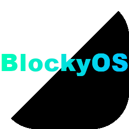

# BlockyOS
### A dumb little OS made with Godot

#### This project uses Godot 3.5.2. Apps as well should use 3.5.2

## Features
* A Desktop with an apps panel
* Smooth animations for everything
* Feel-good window system
* Apps support
* Update Downloader

## Supported Platforms
* Windows
* Linux/X11
* macOS
* Android
